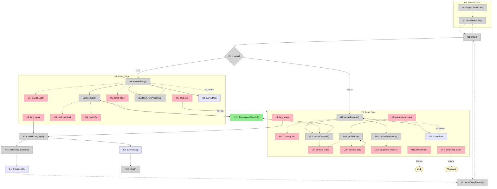

# Rental Listing Info Page — Shaping

## Requirements (R)

| ID | Requirement | Status |
|----|-------------|--------|
| R0 | Clients can self-serve formatted info (rent, vacancy, discounts) for a single property via a web link | Core goal |
| R1 | Reduce agent's time spent repeatedly answering the same questions | Core goal |
| R2 | After viewing info, client can contact agent via LINE / WhatsApp (agent's personal account) | Must-have |
| R3 | Each property has its own shareable URL, sent individually to specific clients | Must-have |
| R4 | Agent can update ~50 properties without writing HTML or code | Must-have |
| R5 | Hosted on GitHub Pages (static) | Must-have |
| R6 | Each property displays: rent, vacancy period (date range), discount terms, address, size, photos (3-5), equipment checklist | Must-have |
| R7 | Page available in both Chinese and English | Must-have |
| R8 | Mobile-friendly layout (most clients will view on phone) | Must-have |
| R9 | 🟡 Clients can browse all available properties from a public listing page with rich preview cards (photo, rent, address, vacancy, size) | Must-have |
| R10 | 🟡 Agent can paste standard Google Drive sharing URLs for photos and they display correctly on the page | Must-have |

---

## A: Static Property Info Page (GitHub Pages + Google Sheet)

| Part | Mechanism | Flag |
|------|-----------|:----:|
| **A1** | **Data source**: Agent edits a Google Sheet (one row per property). Columns: property ID, address, size (ping), monthly rent, vacancy start/end dates, photo URLs (3-5), and equipment checkboxes (boolean columns — extensible, agent adds new `equip_*` columns as needed). Sheet is published to web. Client-side JS fetches the CSV and renders. | |
| **A1.1** | **Photo URL transform**: Single utility function `transformPhotoUrl(url)` called at every `img.src` assignment. Transforms Google Drive sharing URLs to displayable image URLs. Non-Drive URLs pass through unchanged. | |
| A1.1a | **Pattern recognition**: Regex `/\/file\/d\/([a-zA-Z0-9_-]+)/` matches `drive.google.com/file/d/{ID}/view?usp=drive_link`, `...?usp=sharing`, and `...?usp=drive_link` variants. Extracts the ~33-char file ID. | |
| A1.1b | **URL rewrite**: Constructs `https://lh3.googleusercontent.com/d/{ID}=w1000` from extracted ID. The `=w1000` suffix requests a 1000px-wide image from Google's image proxy. | |
| A1.1c | **Passthrough**: If URL doesn't match the Drive pattern, returns it unchanged. Supports direct image URLs (placehold.co, imgur, any `https://.../*.jpg`). | |
| A1.1d | **Call sites**: Two `img.src` assignments — `renderCarousel()` (detail view, line 784) and `buildCard()` (listing card thumbnail, line 886). Both call `transformPhotoUrl()` before setting `src`. | |
| **A1.2** | **Bilingual data**: Sheet has paired columns for bilingual fields — e.g., `address_zh` / `address_en`. Equipment checklist uses icons/universal labels, so no translation needed there. Rent/dates/numbers are language-neutral. | |
| **A2** | **Page template**: Clean card layout — property photo carousel at top, key info (rent, vacancy, discount) in a summary block, then address, size, equipment checklist below. | |
| **A2.1** | **Mobile-first responsive**: Single-column card layout optimized for phone screens. Large tap targets for buttons, readable text without zooming. | |
| **A2.2** | **Language toggle**: Page has a ZH/EN toggle. Switches displayed text between Chinese and English columns from the Sheet. URL can include `&lang=en` or `&lang=zh` so agent can send a language-appropriate link. Toggle visible on both listing and detail views. | |
| **A3** | **Discount display**: Shows a fixed notice — "Lease over 1 year eligible for discount, details negotiable" (中：簽約一年以上享有折扣，幅度面議). No percentage in Sheet — just a universal text message on every property page. | |
| **A4** | **Messaging CTA**: Fixed bottom bar with LINE and WhatsApp buttons. LINE opens `https://line.me/ti/p/~{LINE_ID}`. WhatsApp opens `https://wa.me/{PHONE}`. Both configured once in the HTML (same contact for all properties). Only shown on detail view. | |
| **A5** | **Per-property URL**: Query parameter routing (`?id=property-id&lang=zh`). Single `index.html` reads `id` param, fetches Sheet CSV, finds matching row, renders. 404 message if ID not found. | |
| **A6** | 🟡 **Listing page**: When no `?id=` param, shows a branded listing page titled "Jerry in the house". Lists all properties as rich preview cards. Each card: 4:3 photo thumbnail (`photo_1`), full rent (`NT$ 18,000 / 月`), short address (city + district only, e.g. "台北市大安區"), size (坪), vacancy period. Cards link to `?id=xxx&lang=currentLang`. Auto-filtered by `vacancy_end` (only future vacancies). Sorted by Sheet row order. Empty state: "目前沒有空房，請保持跟我聯絡！" with LINE/WhatsApp buttons. Same `index.html`, same CSV, bilingual. | |

---

## Google Sheet Structure

| Column | Example | Notes |
|--------|---------|-------|
| `id` | `daan-3F` | Unique ID, used in URL |
| `address_zh` | `台北市大安區...` | Chinese address |
| `address_en` | `Da'an District, Taipei...` | English address |
| `district_zh` | `台北市大安區` | 🟡 Chinese city+district (for listing card) |
| `district_en` | `Da'an, Taipei` | 🟡 English city+district (for listing card) |
| `size_ping` | `12` | Size in ping |
| `rent` | `18000` | Monthly rent in TWD |
| `vacancy_start` | `2026/4/1` | Vacancy period start |
| `vacancy_end` | `2026/5/1` | Vacancy period end |
| `photo_1` ~ `photo_5` | Google Drive sharing URL | 🟡 Agent pastes Drive sharing URLs directly; client JS transforms to displayable format |
| `equip_ac` | `TRUE` | Air conditioning |
| `equip_washer` | `TRUE` | Washing machine |
| `equip_fridge` | `TRUE` | Refrigerator |
| `equip_internet` | `TRUE` | Internet |
| `equip_water_heater` | `TRUE` | Water heater |
| `equip_desk` | `FALSE` | Desk |
| `equip_wardrobe` | `TRUE` | Wardrobe |
| `equip_*` | ... | Extensible — agent adds new equipment columns as needed |

---

## Fit Check: R x A

| Req | Requirement | Status | A |
|-----|-------------|--------|---|
| R0 | Clients can self-serve formatted info for a single property via a web link | Core goal | ✅ |
| R1 | Reduce agent's time spent repeatedly answering the same questions | Core goal | ✅ |
| R2 | After viewing info, client can contact agent via LINE / WhatsApp (personal account) | Must-have | ✅ |
| R3 | Each property has its own shareable URL, sent individually to specific clients | Must-have | ✅ |
| R4 | Agent can update ~50 properties without writing HTML or code | Must-have | ✅ |
| R5 | Hosted on GitHub Pages (static) | Must-have | ✅ |
| R6 | Each property displays: rent, vacancy period, discount terms, address, size, photos, equipment checklist | Must-have | ✅ |
| R7 | Page available in both Chinese and English | Must-have | ✅ |
| R8 | Mobile-friendly layout | Must-have | ✅ |
| R9 | 🟡 Clients can browse all available properties from a public listing page with rich preview cards | Must-have | ✅ |
| R10 | 🟡 Agent can paste standard Google Drive sharing URLs for photos and they display correctly on the page | Must-have | ✅ |

All requirements pass. No flags remaining.

---

## Parts x Requirements

| Part | | R0 | R1 | R2 | R3 | R4 | R5 | R6 | R7 | R8 | R9 | R10 |
|------|------|:---:|:---:|:---:|:---:|:---:|:---:|:---:|:---:|:---:|:---:|:---:|
| **A1** | Data source (Google Sheet + client JS) | | | | | ✅ | ✅ | | | | | |
| **A1.1** | 🟡 Photo URL transform (`transformPhotoUrl()` utility) | | | | | ✅ | | ✅ | | | | ✅ |
| A1.1a | Pattern recognition (regex extracts file ID from Drive URL) | | | | | | | | | | | ✅ |
| A1.1b | URL rewrite (`lh3.googleusercontent.com/d/{ID}=w1000`) | | | | | | | | | | | ✅ |
| A1.1c | Passthrough (non-Drive URLs unchanged) | | | | | ✅ | | | | | | ✅ |
| A1.1d | Call sites (carousel line 784, card thumbnail line 886) | | | | | | | ✅ | | | | ✅ |
| **A1.2** | Bilingual data (paired columns) | | | | | ✅ | | | ✅ | | | |
| **A2** | Page template (card layout) | ✅ | ✅ | | | | ✅ | ✅ | | | | |
| **A2.1** | Mobile-first responsive | | | | | | | | | ✅ | | |
| **A2.2** | Language toggle (ZH/EN) | | | | | | | | ✅ | | | |
| **A3** | Discount display | ✅ | ✅ | | | | | ✅ | | | | |
| **A4** | Messaging CTA (LINE + WhatsApp) | | | ✅ | | | | | | | | |
| **A5** | Per-property URL (?id=xxx&lang=xx) | ✅ | | | ✅ | | ✅ | | | | | |
| **A6** | 🟡 Listing page (rich cards, auto-filter) | | ✅ | | | | | | | ✅ | ✅ | |

---

## Breadboard A

### Places

| # | Place | Description |
|---|-------|-------------|
| P1 | Listing Page | Browse available properties (no `?id=` param) |
| P2 | Detail Page | Single property info (`?id=xxx`) |
| P3 | External Data | Google Sheet CSV endpoint |

### UI Affordances

| # | Place | Affordance | Control | Wires Out | Returns To |
|---|-------|------------|---------|-----------|------------|
| U1 | P1 | brand header ("Jerry in the house") | render | — | — |
| U2 | P1 | language toggle | click | → N14 | — |
| U3 | P1 | card thumbnail (photo) | render | — | — |
| U4 | P1 | card info (rent, district, size, vacancy) | render | — | — |
| U5 | P1 | card click | click | → P2 | — |
| U6 | P1 | empty state (msg + LINE/WhatsApp buttons) | render | — | — |
| U7 | P2 | language toggle | click | → N14 | — |
| U8 | P2 | carousel slides | render | — | — |
| U9 | P2 | carousel prev/next | click | → N16 | — |
| U10 | P2 | carousel dots | click | → N16 | — |
| U11 | P2 | property info (rent, vacancy, discount, address, size) | render | — | — |
| U12 | P2 | equipment checklist | render | — | — |
| U13 | P2 | LINE CTA button | click | → external | — |
| U14 | P2 | WhatsApp CTA button | click | → external | — |

### Code Affordances

| # | Place | Affordance | Control | Wires Out | Returns To |
|---|-------|------------|---------|-----------|------------|
| N1 | — | `main()` | call | → N2, → N3, → N5 | — |
| N2 | — | `parseQueryParams()` | call | — | → N1 |
| N3 | P3 | `fetchSheetCSV()` | call | — | → N1 |
| N4 | P3 | Google Sheet CSV endpoint | external | — | → N3 |
| N5 | — | route: `id` exists → N9, else → N6 | conditional | → N6 or N9 | — |
| N6 | P1 | `renderListing(data)` | call | → N7, → N8 | → U1, U6 |
| N7 | P1 | `filterActiveProperties(data)` | call | — | → N6 |
| N8 | P1 | `buildCard(row)` | call | → N13 | → U3, U4, U5 |
| N9 | P2 | `renderProperty(row)` | call | → N10, → N11 | → U11 |
| N10 | P2 | `renderCarousel(row)` | call | → N13 | → U8, U9, U10 |
| N11 | P2 | `renderEquipment(row)` | call | — | → U12 |
| N12 | — | `t(key)` i18n lookup | call | — | → caller |
| N13 | — | 🟡 `transformPhotoUrl(url)` | call | — | → N8, N10 |
| N14 | — | `switchLanguage()` | call | → N15, → N6 or N9 | — |
| N15 | — | `history.replaceState()` | call | → S4 | — |
| N16 | P2 | `goTo(index)` | call | — | → U8, U10 |

### Data Stores

| # | Place | Store | Description |
|---|-------|-------|-------------|
| S1 | P3 | Google Sheet CSV | External CSV data (fetched once at page load) |
| S2 | — | `currentData` | Parsed CSV rows array (all properties) |
| S3 | — | `currentLang` | Current language (`'zh'` or `'en'`) |
| S4 | — | Browser URL | `?id=xxx&lang=zh` query params |
| S5 | P2 | `currentRow` | Current property row (for re-rendering on lang switch) |

### Diagram

