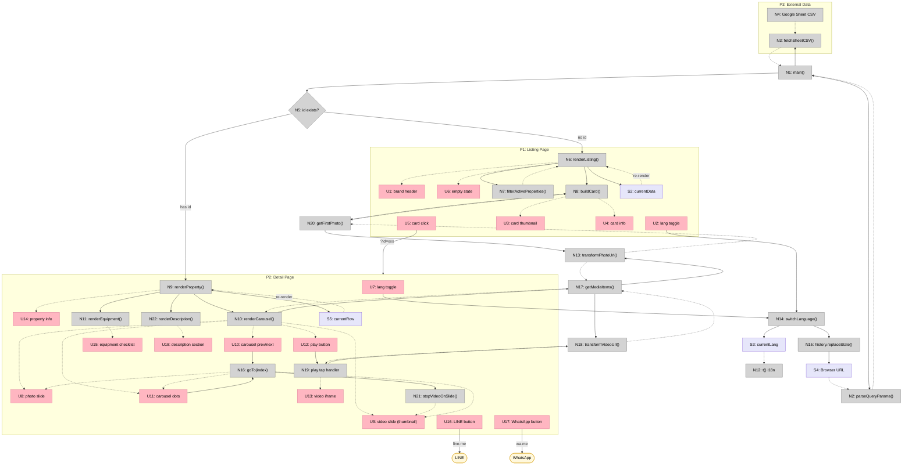
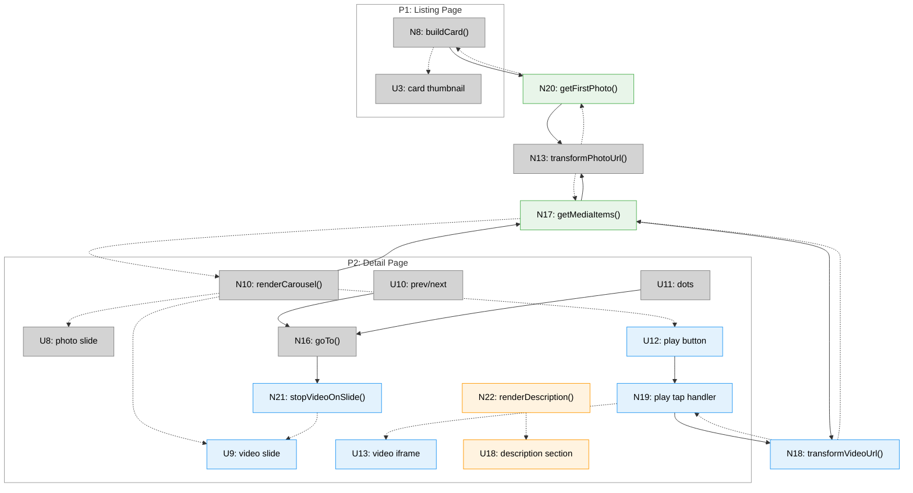

# Rental Listing Info Page — Shaping

## Requirements (R)

| ID | Requirement | Status |
|----|-------------|--------|
| R0 | Clients can self-serve formatted info (rent, vacancy, discounts) for a single property via a web link | Core goal |
| R1 | Reduce agent's time spent repeatedly answering the same questions | Core goal |
| R2 | After viewing info, client can contact agent via LINE / WhatsApp (agent's personal account) | Must-have |
| R3 | Each property has its own shareable URL, sent individually to specific clients | Must-have |
| R4 | Agent can update ~50 properties without writing HTML or code | Must-have |
| R5 | Hosted on GitHub Pages (static) | Must-have |
| 🟡 R6 | Each property displays: rent, vacancy period (date range), discount terms, address, size, media (photos and videos, up to 8), equipment checklist | Must-have |
| R7 | Page available in both Chinese and English | Must-have |
| R8 | Mobile-friendly layout (most clients will view on phone) | Must-have |
| R9 | 🟡 Clients can browse all available properties from a public listing page with rich preview cards (photo, rent, address, vacancy, size) | Must-have |
| 🟡 R10 | Agent can paste standard Google Drive sharing URLs for photos and videos and they display correctly on the page | Must-have |
| R11 | Property listings can include a video that readers can watch directly on the page | Must-have |
| R12 | Agent can interleave photos and videos in a custom order within the carousel | Must-have |
| 🟡 R13 | Each property detail page displays a rich text description (headings, bullet points, line breaks) written by the agent | Core goal |
| 🟡 R14 | Agent can write and edit descriptions without coding — same ease-of-use as the current Google Sheet workflow | Must-have |
| 🟡 R15 | Description supports bilingual content (Chinese + English versions) | Must-have |
| 🟡 R16 | Multiline text with structure (paragraphs, lists, sub-sections) survives the data pipeline from source to rendered page | Must-have |

---

## A: Static Property Info Page (GitHub Pages + Google Sheet)

| Part | Mechanism | Flag |
|------|-----------|:----:|
| **A1** | **Data source**: Agent edits a Google Sheet (one row per property). Columns: property ID, address, size (ping), monthly rent, vacancy start/end dates, media URLs with type (`media_1`–`media_8` + `media_1_type`–`media_8_type`, type = `photo` or `video`), and equipment checkboxes (boolean columns — extensible, agent adds new `equip_*` columns as needed). Sheet is published to web. Client-side JS fetches the CSV and renders. | |
| **A1.1** | **Photo URL transform**: Single utility function `transformPhotoUrl(url)` called at every `img.src` assignment. Transforms Google Drive sharing URLs to displayable image URLs. Non-Drive URLs pass through unchanged. | |
| A1.1a | **Pattern recognition**: Regex `/\/file\/d\/([a-zA-Z0-9_-]+)/` matches `drive.google.com/file/d/{ID}/view?usp=drive_link`, `...?usp=sharing`, and `...?usp=drive_link` variants. Extracts the ~33-char file ID. | |
| A1.1b | **URL rewrite**: Constructs `https://lh3.googleusercontent.com/d/{ID}=w1000` from extracted ID. The `=w1000` suffix requests a 1000px-wide image from Google's image proxy. | |
| A1.1c | **Passthrough**: If URL doesn't match the Drive pattern, returns it unchanged. Supports direct image URLs (placehold.co, imgur, any `https://.../*.jpg`). | |
| A1.1d | **Call sites**: Called from `renderCarousel()` for photo-type slides and from `buildCard()` via `getFirstPhoto()` for listing card thumbnails. | |
| 🟡 **A1.3** | **Multiline-aware CSV parser**: Replace naive `csvText.split('\n')` row-splitting in `parseCSV()` with a quote-aware splitter that keeps newlines inside quoted fields intact. Google Sheets CSV export wraps multiline cells in double quotes per RFC 4180 — the format is fine, our parser just ignores the quoting when splitting rows. `parseCSVLine()` already handles quoted fields correctly within a single line; only the row-splitting logic needs to change. | |
| **A1.2** | **Bilingual data**: Sheet has paired columns for bilingual fields — e.g., `address_zh` / `address_en`. Equipment checklist uses icons/universal labels, so no translation needed there. Rent/dates/numbers are language-neutral. | |
| **A2** | **Page template**: Clean card layout — property media carousel (photos + videos) at top, key info (rent, vacancy, discount) in a summary block, then address, size, equipment checklist below. | |
| **A2.1** | **Mobile-first responsive**: Single-column card layout optimized for phone screens. Large tap targets for buttons, readable text without zooming. | |
| **A2.2** | **Language toggle**: Page has a ZH/EN toggle. Switches displayed text between Chinese and English columns from the Sheet. URL can include `&lang=en` or `&lang=zh` so agent can send a language-appropriate link. Toggle visible on both listing and detail views. | |
| **A3** | **Discount display**: Shows a fixed notice — "Lease over 1 year eligible for discount, details negotiable" (中：簽約一年以上享有折扣，幅度面議). No percentage in Sheet — just a universal text message on every property page. | |
| **A4** | **Messaging CTA**: Fixed bottom bar with LINE and WhatsApp buttons. LINE opens `https://line.me/ti/p/~{LINE_ID}`. WhatsApp opens `https://wa.me/{PHONE}`. Both configured once in the HTML (same contact for all properties). Only shown on detail view. | |
| **A5** | **Per-property URL**: Query parameter routing (`?id=property-id&lang=zh`). Single `index.html` reads `id` param, fetches Sheet CSV, finds matching row, renders. 404 message if ID not found. | |
| **A6** | **Listing page**: When no `?id=` param, shows a branded listing page titled "Jerry in the house". Lists all properties as rich preview cards. Each card: 4:3 photo thumbnail (first `photo`-type media item via `getFirstPhoto()`), full rent (`NT$ 18,000 / 月`), short address (city + district only, e.g. "台北市大安區"), size (坪), vacancy period. Cards link to `?id=xxx&lang=currentLang`. Auto-filtered by `vacancy_end` (only future vacancies). Sorted by Sheet row order. Empty state: "目前沒有空房，請保持跟我聯絡！" with LINE/WhatsApp buttons. Same `index.html`, same CSV, bilingual. | |
| **A7** | **Mixed media carousel**: Unified `media_1`–`media_8` columns with `media_1_type`–`media_8_type` (dropdown: `photo`/`video`). Carousel renders both photo and video slides in agent-defined order. Video slides show thumbnail + play button; tap to load iframe player; swipe away stops playback. Replaces `photo_1`–`photo_5`. | |
| A7.1 | **Unified media columns**: `media_1`–`media_8` for URLs + `media_1_type`–`media_8_type` for type (`photo` or `video`, default `photo`). Order = column order. Type enforced by Google Sheets dropdown data validation. Replaces `photo_1`–`photo_5` and `video_url`. | |
| A7.2 | **Video URL transform**: `transformVideoUrl(url)` extracts file ID using same regex as photos (`/\/file\/d\/([a-zA-Z0-9_-]+)/`), constructs `https://drive.google.com/file/d/{ID}/preview` for iframe embed. Separate from photo transform (different output URL, different render element). | |
| A7.3 | **Mixed carousel rendering**: `getMediaItems(row)` reads `media_N` + `media_N_type` pairs into an ordered list. `renderCarousel()` iterates the list: photo items → `` via `transformPhotoUrl()`; video items → thumbnail image (`drive.google.com/thumbnail?id={ID}&sz=w1000`) with play button overlay. Carousel keeps 4:3 aspect ratio — videos letterbox inside the container. | |
| A7.4 | **Thumbnail-to-iframe swap**: Tap play button on video slide → replace thumbnail with `<iframe src=".../preview" allow="autoplay; encrypted-media" allowfullscreen>`. On `goTo()` (swipe/button/dot), if leaving a playing video slide → remove iframe, restore thumbnail + play button (stops playback, prevents background audio). | |
| A7.5 | **Listing card thumbnail**: `getFirstPhoto(row)` scans `media_1`–`media_8`, returns the first item where type = `photo`. Used by `buildCard()` for the listing page card thumbnail. Skips video items — listing cards always show a static photo. | |
| 🟡 **A8** | **Property description**: Agent writes a free-form marketing description per property in the Google Sheet. Description appears on the detail page as a rich text section below the summary info block. Supports headings, bullet points, paragraphs, and line breaks. Bilingual via paired columns (`description_zh` / `description_en`). | |
| 🟡 A8.1 | **Description columns**: `description_zh` and `description_en` columns in the Sheet. Agent types multiline text directly in the cell (Google Sheets supports this with Alt+Enter / Ctrl+Enter). CSV export wraps the cell in double quotes with literal newlines — handled by A1.3. | |
| 🟡 A8.2 | **Description rendering**: `renderDescription(row)` reads `row['description_' + currentLang]`, converts plain text to HTML preserving structure: blank lines → paragraph breaks, lines starting with `*` → bullet list items, lines starting with `#` (or all-caps/colon-ending) → bold headings. Renders in a new `.description` section on the detail page between property info and equipment checklist. If description is empty, section is hidden. | |

---

## Google Sheet Structure

| Column | Example | Notes |
|--------|---------|-------|
| `id` | `daan-3F` | Unique ID, used in URL |
| `address_zh` | `台北市大安區...` | Chinese address |
| `address_en` | `Da'an District, Taipei...` | English address |
| `district_zh` | `台北市大安區` | 🟡 Chinese city+district (for listing card) |
| `district_en` | `Da'an, Taipei` | 🟡 English city+district (for listing card) |
| `size_ping` | `12` | Size in ping |
| `rent` | `18000` | Monthly rent in TWD |
| `vacancy_start` | `2026/4/1` | Vacancy period start |
| `vacancy_end` | `2026/5/1` | Vacancy period end |
| `media_1` ~ `media_8` | Google Drive sharing URL | Agent pastes Drive sharing URLs; order = column order; replaces `photo_1`–`photo_5` |
| `media_1_type` ~ `media_8_type` | `photo` or `video` | Dropdown data validation; defaults to `photo` if empty |
| `equip_ac` | `TRUE` | Air conditioning |
| `equip_washer` | `TRUE` | Washing machine |
| `equip_fridge` | `TRUE` | Refrigerator |
| `equip_internet` | `TRUE` | Internet |
| `equip_water_heater` | `TRUE` | Water heater |
| `equip_desk` | `FALSE` | Desk |
| `equip_wardrobe` | `TRUE` | Wardrobe |
| `equip_*` | ... | Extensible — agent adds new equipment columns as needed |
| 🟡 `description_zh` | `精緻共居空間...` | Chinese description (multiline, free-form text) |
| 🟡 `description_en` | `Chic Shared Living...` | English description (multiline, free-form text) |

---

## Fit Check: R x A

| Req | Requirement | Status | A |
|-----|-------------|--------|---|
| R0 | Clients can self-serve formatted info for a single property via a web link | Core goal | ✅ |
| R1 | Reduce agent's time spent repeatedly answering the same questions | Core goal | ✅ |
| R2 | After viewing info, client can contact agent via LINE / WhatsApp (personal account) | Must-have | ✅ |
| R3 | Each property has its own shareable URL, sent individually to specific clients | Must-have | ✅ |
| R4 | Agent can update ~50 properties without writing HTML or code | Must-have | ✅ |
| R5 | Hosted on GitHub Pages (static) | Must-have | ✅ |
| 🟡 R6 | Each property displays: rent, vacancy period, discount terms, address, size, media (photos and videos, up to 8), equipment checklist | Must-have | ✅ |
| R7 | Page available in both Chinese and English | Must-have | ✅ |
| R8 | Mobile-friendly layout | Must-have | ✅ |
| R9 | 🟡 Clients can browse all available properties from a public listing page with rich preview cards | Must-have | ✅ |
| 🟡 R10 | Agent can paste standard Google Drive sharing URLs for photos and videos and they display correctly on the page | Must-have | ✅ |
| R11 | Property listings can include a video that readers can watch directly on the page | Must-have | ✅ |
| 🟡 R12 | Agent can interleave photos and videos in a custom order within the carousel | Must-have | ✅ |
| 🟡 R13 | Each property detail page displays a rich text description (headings, bullet points, line breaks) written by the agent | Core goal | ✅ |
| 🟡 R14 | Agent can write and edit descriptions without coding — same ease-of-use as the current Google Sheet workflow | Must-have | ✅ |
| 🟡 R15 | Description supports bilingual content (Chinese + English versions) | Must-have | ✅ |
| 🟡 R16 | Multiline text with structure (paragraphs, lists, sub-sections) survives the data pipeline from source to rendered page | Must-have | ✅ |

R0–R12: All pass. R11 + R12 resolved by spike v2 (see `spike-a7-video-support.md`).
🟡 R13–R16: Pass via new parts A1.3 (multiline CSV parser fix) + A8 (description columns + rendering). Spike confirmed Google Sheets CSV export handles multiline cells correctly (RFC 4180 quoting) — the blocker was our naive row-splitting parser, not the data format.

---

## Parts x Requirements

| Part | | R0 | R1 | R2 | R3 | R4 | R5 | R6 | R7 | R8 | R9 | R10 | R11 | R12 | R13 | R14 | R15 | R16 |
|------|------|:---:|:---:|:---:|:---:|:---:|:---:|:---:|:---:|:---:|:---:|:---:|:---:|:---:|:---:|:---:|:---:|:---:|
| **A1** | Data source (Google Sheet + client JS, unified media columns) | | | | | ✅ | ✅ | | | | | | | | | | | |
| **A1.1** | Photo URL transform (`transformPhotoUrl()`) | | | | | ✅ | | 🟡 ✅ | | | | ✅ | | | | | | |
| A1.1a | Pattern recognition (regex extracts file ID from Drive URL) | | | | | | | | | | | ✅ | | | | | | |
| A1.1b | URL rewrite (`lh3.googleusercontent.com/d/{ID}=w1000`) | | | | | | | | | | | ✅ | | | | | | |
| A1.1c | Passthrough (non-Drive URLs unchanged) | | | | | ✅ | | | | | | ✅ | | | | | | |
| A1.1d | Call sites (carousel photo slides, listing card via `getFirstPhoto()`) | | | | | | | 🟡 ✅ | | | | ✅ | | | | | | |
| 🟡 **A1.3** | Multiline-aware CSV parser (quote-aware row splitting) | | | | | ✅ | | | | | | | | | | ✅ | | ✅ |
| **A1.2** | Bilingual data (paired columns) | | | | | ✅ | | | ✅ | | | | | | | | 🟡 ✅ | |
| **A2** | Page template (card layout) | ✅ | ✅ | | | | ✅ | ✅ | | | | | | | | | | |
| **A2.1** | Mobile-first responsive | | | | | | | | | ✅ | | | | | | | | |
| **A2.2** | Language toggle (ZH/EN) | | | | | | | | ✅ | | | | | | | | | |
| **A3** | Discount display | ✅ | ✅ | | | | | ✅ | | | | | | | | | | |
| **A4** | Messaging CTA (LINE + WhatsApp) | | | ✅ | | | | | | | | | | | | | | |
| **A5** | Per-property URL (?id=xxx&lang=xx) | ✅ | | | ✅ | | ✅ | | | | | | | | | | | |
| **A6** | Listing page (rich cards, auto-filter, thumbnail via `getFirstPhoto()`) | | ✅ | | | | | | | ✅ | ✅ | | | | | | | |
| **A7** | Mixed media carousel | | | | | | | | | | | | ✅ | ✅ | | | | |
| A7.1 | Unified media columns (`media_1-8` + `media_1_type-8_type`) | | | | | ✅ | | | | | | | ✅ | ✅ | | | | |
| A7.2 | Video URL transform (`transformVideoUrl()`) | | | | | ✅ | | | | | | 🟡 ✅ | ✅ | | | | | |
| A7.3 | Mixed carousel rendering (`getMediaItems()`, photo `` / video thumbnail + play) | | | | | | | 🟡 ✅ | | ✅ | | | ✅ | ✅ | | | | |
| A7.4 | Thumbnail-to-iframe swap (tap play → iframe; swipe away → stop) | | | | | | | | | ✅ | | | ✅ | | | | | |
| A7.5 | Listing card thumbnail (`getFirstPhoto()`) | | | | | | | | | | ✅ | | | | | | | |
| 🟡 **A8** | Property description (free-form marketing text on detail page) | ✅ | ✅ | | | | | | | | | | | | ✅ | | | |
| 🟡 A8.1 | Description columns (`description_zh` / `description_en`) | | | | | ✅ | | | ✅ | | | | | | | ✅ | ✅ | |
| 🟡 A8.2 | Description rendering (`renderDescription()`, plain text → HTML) | | | | | | | | | ✅ | | | | | ✅ | | | |

---

## Breadboard A

### Places

| # | Place | Description |
|---|-------|-------------|
| P1 | Listing Page | Browse available properties (no `?id=` param) |
| P2 | Detail Page | Single property info (`?id=xxx`) |
| P3 | External Data | Google Sheet CSV endpoint |

### UI Affordances

| # | Place | Affordance | Control | Wires Out | Returns To |
|---|-------|------------|---------|-----------|------------|
| U1 | P1 | brand header ("Jerry in the house") | render | — | — |
| U2 | P1 | language toggle | click | → N14 | — |
| U3 | P1 | card thumbnail (first photo) | render | — | — |
| U4 | P1 | card info (rent, district, size, vacancy) | render | — | — |
| U5 | P1 | card click | click | → P2 | — |
| U6 | P1 | empty state (msg + LINE/WhatsApp buttons) | render | — | — |
| U7 | P2 | language toggle | click | → N14 | — |
| U8 | P2 | carousel slide — photo (``) | render | — | — |
| U9 | P2 | carousel slide — video (thumbnail + play overlay) | render | — | — |
| U10 | P2 | carousel prev/next | click | → N16 | — |
| U11 | P2 | carousel dots | click | → N16 | — |
| U12 | P2 | play button overlay | click | → N19 | — |
| U13 | P2 | video iframe (after play tap) | render | — | — |
| U14 | P2 | property info (rent, vacancy, discount, address, size) | render | — | — |
| U15 | P2 | equipment checklist | render | — | — |
| U16 | P2 | LINE CTA button | click | → external | — |
| U17 | P2 | WhatsApp CTA button | click | → external | — |
| 🟡 U18 | P2 | description section (headings, bullets, paragraphs) | render | — | — |

### Code Affordances

| # | Place | Affordance | Control | Wires Out | Returns To |
|---|-------|------------|---------|-----------|------------|
| N1 | — | `main()` | call | → N2, → N3, → N5 | — |
| N2 | — | `parseQueryParams()` | call | — | → N1 |
| N3 | P3 | `fetchSheetCSV()` | call | — | → N1 |
| N4 | P3 | Google Sheet CSV endpoint | external | — | → N3 |
| N5 | — | route: `id` exists → N9, else → N6 | conditional | → N6 or N9 | — |
| N6 | P1 | `renderListing(data)` | call | → N7, → N8 | → U1, U6 |
| N7 | P1 | `filterActiveProperties(data)` | call | — | → N6 |
| N8 | P1 | `buildCard(row)` | call | → N20 | → U3, U4, U5 |
| N9 | P2 | `renderProperty(row)` | call | → N10, → N11, 🟡 → N22, → S5 | → U14 |
| N10 | P2 | `renderCarousel(row)` | call | → N17 | → U8, U9, U10, U11, U12 |
| N11 | P2 | `renderEquipment(row)` | call | — | → U15 |
| N12 | — | `t(key)` i18n lookup | call | — | → caller |
| N13 | — | `transformPhotoUrl(url)` | call | — | → caller |
| N14 | — | `switchLanguage()` | call | → N15, → S3 | — |
| N15 | — | `history.replaceState()` | call | → S4 | — |
| N16 | P2 | `goTo(index)` | call | → N21 | → U8, U9, U11 |
| N17 | — | `getMediaItems(row)` | call | → N13, → N18 | → N10 |
| N18 | — | `transformVideoUrl(url)` | call | — | → caller |
| N19 | P2 | play tap handler: swap thumbnail → `<iframe>` | call | → N18 | → U13 |
| N20 | — | `getFirstPhoto(row)` | call | → N13 | → N8 |
| N21 | P2 | `stopVideoOnSlide(el)`: swap `<iframe>` → thumbnail | call | — | → U9 |
| 🟡 N22 | P2 | `renderDescription(row)`: read `row['description_' + currentLang]`, convert plain text to HTML (blank lines → `
`, `*` lines → `<li>`, heading lines → `<strong>`), insert into `.description` section. Hidden if empty. | call | — | → U18 |

### Data Stores

| # | Place | Store | Description |
|---|-------|-------|-------------|
| S1 | P3 | Google Sheet CSV | External CSV data (fetched once at page load) |
| S2 | P1 | `currentData` | Parsed CSV rows array (all properties) |
| S3 | — | `currentLang` | Current language (`'zh'` or `'en'`) |
| S4 | — | Browser URL | `?id=xxx&lang=zh` query params |
| S5 | P2 | `currentRow` | Current property row (for re-rendering on lang switch) |

### Diagram

---

## Slices

### Already built

| Slice | What | Parts | Commit |
|-------|------|-------|--------|
| V1–V3 | Single property detail page: carousel, bilingual, CTA buttons | A1, A1.1, A1.2, A2, A2.1, A2.2, A3, A4, A5 | `c5fa9c0` |
| V4 | Listing page with rich cards, auto-filter by vacancy | A6 | `fe46c8b` |
| V5 | Google Drive photo URL transform | A1.1a–d | `d362437` |

### New slices

| # | Slice | Parts | Affordances | Demo |
|---|-------|-------|-------------|------|
| V6 | Migrate to unified media columns | A7.1, A7.3 (photo only), A7.5 | N17, N20; modify N8, N10 | "Photos display same as before, but data comes from `media_1-8` columns with type dropdown" |
| V7 | Video in carousel | A7.2, A7.3 (video), A7.4 | U9, U12, U13, N18, N19, N21; modify N16, N17 | "Videos appear between photos with ▶; tap to play inline; swipe away stops playback" |
| 🟡 V10 | Property description with multiline CSV support | A1.3, A8, A8.1, A8.2 | N22, U18; modify N9, `parseCSV()` | "Agent types multiline description in Sheet. Detail page renders headings, bullets, paragraphs. ZH/EN toggle switches. Empty descriptions hidden." |

---

### V6: Migrate to unified media columns

Non-breaking migration: photos keep working, data source changes from `photo_1-5` to `media_1-8` + `media_1_type-8_type`. Video-type items are read but skipped in rendering (handled in V7).

**New affordances**

| # | Place | Affordance | Control | Wires Out | Returns To |
|---|-------|------------|---------|-----------|------------|
| N17 | — | `getMediaItems(row)`: read `media_N` + `media_N_type` pairs, return `[{url, type}]` | call | → N13 | → N10 |
| N20 | — | `getFirstPhoto(row)`: scan items, return first `type=photo` URL | call | → N13 | → N8 |

**Modified affordances**

| # | Affordance | Change |
|---|------------|--------|
| N10 | `renderCarousel(row)` | Was: reads `photo_1-5` directly. Now: calls N17 `getMediaItems()`, iterates items, renders `` for `type=photo`, skips `type=video` |
| N8 | `buildCard(row)` | Was: uses `row.photo_1` for thumbnail. Now: calls N20 `getFirstPhoto()` |

**Data migration**

| Before | After |
|--------|-------|
| `photo_1` ~ `photo_5` | `media_1` ~ `media_8` + `media_1_type` ~ `media_8_type` |

**Demo:** "Listing page cards and detail page carousel show photos identically. Google Sheet now uses `media_1-8` columns with `photo`/`video` type dropdown."

---

### V7: Video in carousel

Adds video support to the mixed carousel. Video slides render as thumbnail + play button; tap plays inline via iframe; swipe away stops playback.

**New affordances**

| # | Place | Affordance | Control | Wires Out | Returns To |
|---|-------|------------|---------|-----------|------------|
| U9 | P2 | carousel slide — video (thumbnail + play overlay) | render | — | — |
| U12 | P2 | play button overlay | click | → N19 | — |
| U13 | P2 | video iframe (after play tap) | render | — | — |
| N18 | — | `transformVideoUrl(url)`: regex extract ID → `drive.google.com/file/d/{ID}/preview` | call | — | → caller |
| N19 | P2 | play tap handler: replace thumbnail with `<iframe src=".../preview">` | call | → N18 | → U13 |
| N21 | P2 | `stopVideoOnSlide(el)`: remove iframe, restore thumbnail + play button | call | — | → U9 |

**Modified affordances**

| # | Affordance | Change |
|---|------------|--------|
| N17 | `getMediaItems(row)` | Was: returns items, used only for photos. Now: also calls N18 `transformVideoUrl()` for video items, returns video thumbnail URL + embed URL |
| N16 | `goTo(index)` | Was: just slides. Now: calls N21 `stopVideoOnSlide()` on current slide before transitioning (prevents background audio) |

**New CSS**

| Element | Style |
|---------|-------|
| `.carousel-play-btn` | Centered ▶ circle overlay (white bg, semi-transparent, 48×48px) on video thumbnail |
| `.carousel-slide iframe` | `width: 100%; height: 100%; border: 0; background: #000` fills 4:3 container |
| `.carousel-slide.playing` | Marks slide with active iframe (used by N21 to find playing videos) |

**Demo:** "Carousel shows video thumbnails with ▶ button between photos in agent-defined order. Tap ▶ to play video inline. Swipe to next slide — video stops. Works on mobile."

---

### V10: Property description with multiline CSV support

Two orthogonal changes bundled because the parser fix has no standalone demo.

**1. Parser fix (A1.3)**

| # | Affordance | Change |
|---|------------|--------|
| `parseCSV()` | Was: `csvText.split('\n')` splits all newlines into rows. Now: quote-aware row splitter — tracks `inQuotes` state, only splits on `\n` outside quoted fields. `parseCSVLine()` unchanged (already handles quotes within a line). |

**2. Description feature (A8)**

**New affordances**

| # | Place | Affordance | Control | Wires Out | Returns To |
|---|-------|------------|---------|-----------|------------|
| U18 | P2 | description section (headings, bullets, paragraphs) | render | — | — |
| N22 | P2 | `renderDescription(row)`: read `row['description_' + currentLang]`, convert plain text → HTML, insert into `.description` section. Hidden if empty. | call | — | → U18 |

**Modified affordances**

| # | Affordance | Change |
|---|------------|--------|
| N9 | `renderProperty(row)` | Now also calls N22 `renderDescription(row)`. Description section placed between property info (U14) and equipment checklist (U15). |

**Text → HTML conversion rules (N22)**

| Input pattern | Output |
|---------------|--------|
| Blank line | `

` (paragraph break) |
| Line starting with `*` | `<li>` (bullet item, wrapped in `<ul>`) |
| Line ending with `:` | `<strong>` (heading) |
| Other lines | Appended to current `
` with ` ` |

**New CSS**

| Element | Style |
|---------|-------|
| `.description` | Padding 16px, font-size 14px, line-height 1.6, color #444 |
| `.description ul` | Padding-left 20px, list-style disc |
| `.description strong` | Display block, margin-top 12px, color #222 |

**Demo:** "Agent types multiline description with headings and bullets in Google Sheet. Detail page renders rich formatted text. ZH/EN toggle switches description language. Empty descriptions hidden."

---

### Slice diagram

**Legend:** Grey = already built (modified in-place), Green = V6 (new), Blue = V7 (new), Orange = V10 (new)
